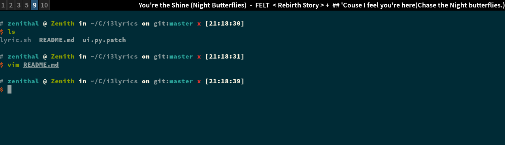

# i3lyrics

This repo is meant for those wanting lyrics shown in their i3bar. Currently only the lyrics of [netease-music](https://github.com/darknessomi/musicbox) can be shown in i3bar. More contribution can be made to make i3bar show more lyrics from more softwares.

## Demo



## lyric.sh

Based on the work of Michael Stapelberg. This script continuously reads the song name and current lyric and wrap them in a block of json and send it to stdout, which is read by i3bar.

The script is now configured to read song name from `/tmp/netease-song` and read current lyric from `/tmp/netease-lyric`. You can change it in your favor, as long as corresponding changes are made in the patch or code.

## config of i3

You should edit the config of i3 and add the following block

```
bar {
    id lyric
    status_command exec /path/to/i3lyric.sh
}
```

You can add other parameters to make this bar suitable for displaying lyrics, the following parameters are listed for you to choose.

```
bar {
    id lyric
    status_command exec /path/to/i3lyric.sh
    position top
    tray_output none
    binding_mode_indicator no
    workspace_buttons no
}
```

## patch of netease-musicbox

You should add patches such that `/tmp/netease-song` and `/tmp/netease-lyric` can be generated when the song is being played.

Currently `ui.py.patch` is against version 0.3.1-2 (-2 added by archlinuxcn pkg) of [netease-music](https://github.com/darknessomi/musicbox). You can make your own changes in `ui.py` as long as the files needed are generated.

One possible path of `ui.py` is `/usr/lib/python3.9/site-packages/NEMbox/ui.py`. Do the patch based on your own situation please.
